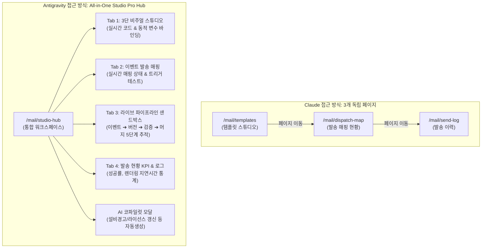

# B2B 메일 템플릿 관리 시스템: Claude vs Antigravity 비교 분석 보고서

> **문서 목적**: B2B 엔터프라이즈 환경에서 메일 템플릿 화면 및 백엔드 스키마 구축 시, **Claude의 분리형 포털 접근법**과 **Antigravity의 올인원 인터랙티브 스튜디오 접근법**의 차이점, 아키텍처 비교, 실무 도입 가이드를 제공합니다.

---

## 1. 아키텍처 및 UI/UX 접근 방식 비교

| 비교 영역 | **Claude 접근 방식 (분리형 엔터프라이즈 포털)** | **Antigravity 접근 방식 (올인원 인터랙티브 스튜디오 Pro)** |
| :--- | :--- | :--- |
| **화면 구조** | **3개 독립 페이지로 분리** • `/mail/templates` (템플릿 관리) • `/mail/dispatch-map` (발송 매핑 현황) • `/mail/send-log` (메일 발송 이력) | **단일 올인원 워크스페이스 (`/mail/studio-hub`)** • [디자인 스튜디오 ↔ 매핑 현황 ↔ 라이브 샌드박스 ↔ 발송 로그]가 4-in-1 일원화 허브로 유기적 연결 |
| **작업 흐름 (Workflow)** | 템플릿 생성 후 라우터를 타고 매핑 화면으로 이동하여 연결하는 **전통적 ERP 포털 방식** | 템플릿 제작 중 우측 변수 서랍 및 상단 테스트/파이프라인 탭으로 **컨텍스트 전환 없이 즉시 시뮬레이션** |
| **편집 및 미리보기** | • 좌측 목록 + 우측 탭(편집/변수/미리보기/버전) • 탭 간 전환 필요 (편집 탭 ➔ 미리보기 탭) | • **3단 분할 스플릿 뷰** [목록 \| 중앙 코드 에디터 \| 우측 실시간 렌더러] • 타이핑하는 즉시 우측 메일 뷰에 실시간 렌더링 반영 |
| **특화 기능 (Unique)** | • Outlook 테이블 레이아웃 가이드 및 인라이너 문서화 • DDL 내 `MAIL_TEMPLATE_ATTACH` (CID 인라인 첨부) 설계 • 버전 테이블 분리 기반 감사 추적 | • **AI 템플릿 어시스턴트 (비즈니스 상황별 프롬프트 자동 생성)** • **라이브 발송 파이프라인 샌드박스 (5단계 실행 검증 디버거)** • **다크모드 시뮬레이션 캔버스** |

---

## 2. 화면 구성 및 핵심 기능 상세 비교

---

## 3. 템플릿 포맷 (HTML vs .vm) 및 DDL 설계 비교

### 3.1 템플릿 엔진 합의점 및 공통 철학
두 모델 모두 **"템플릿 본문은 DB(CLOB/LONGTEXT)에 저장하고, 문법은 Velocity(`.vm`) / Thymeleaf / Plain을 유연하게 수용하는 하이브리드 방식"**을 최적 솔루션으로 채택하였습니다.
- **장점**: 문구 한 줄 수정 때문에 애플리케이션을 재배포(CI/CD)할 필요가 전혀 없음.
- **버전 관리**: 템플릿 본문 수정 시 `UPDATE`가 아니라 `INSERT`로 새 버전을 생성하여 발송 당시의 스냅샷을 100% 보존.

### 3.2 DDL 스키마 비교

| 테이블 명 | Claude DDL | Antigravity 확장 관점 |
| :--- | :--- | :--- |
| `MAIL_TEMPLATE_LAYOUT` | 공통 헤더/푸터/기본 CSS 분리 (CI 변경 시 일괄 반영) | 레이아웃 다국어화(i18n) 및 브랜드별 멀티 테넌트 지원 고려 |
| `MAIL_TEMPLATE` | 마스터 테이블 (`ENGINE_TYPE`, `LOCALE_CODE`, `CURRENT_VERSION_ID`) | 동일 구조 + A/B 테스트 발송 비중(`AB_TEST_RATIO`) 지원 확장성 |
| `MAIL_TEMPLATE_VERSION` | 본문 버전 이력 (`SUBJECT`, `BODY_HTML`, `BODY_TEXT`) | 동일 (감사 추적 및 롤백 가능) |
| `MAIL_TEMPLATE_VAR` | 변수 메타 정의 (`VAR_TYPE`, `REQUIRED_YN`, `SAMPLE_VALUE`) | 동일 (프론트/백엔드 동적 유효성 검증 모델) |
| `MAIL_EVENT` & `MAIL_EVENT_TEMPLATE` | **비즈니스 이벤트와 템플릿 간 N:1 매핑의 단일 진실(Source of Truth)** | 파이프라인 디버거와 실시간 연동되어 샌드박스에서 즉시 실행 |
| `MAIL_SEND_LOG` | 발송 이력 (`VERSION_ID`, `RECEIVER_EMAIL`, `STATUS_CODE`, `ERROR_MSG`) | 통계 집계(성공률, 평균 렌더 지연시간) 대시보드와 즉시 연동 |

---

## 4. 실무 도입 가이드: 어떤 방식을 선택해야 할까?

### 🎯 Case A: Claude 스타일을 추천하는 경우
- **대규모 운영 조직**: 템플릿 디자이너, 시스템 운영자, 모니터링 관제 담당자가 서로 분리되어 있어 각자 전용 화면 URL(`/mail/templates`, `/mail/dispatch-map`, `/mail/send-log`)을 필요로 할 때.
- **전형적인 엔터프라이즈 ERP 포털**: 각 메뉴가 명확한 권한 체계로 쪼개져야 하는 관리 시스템.

### 🚀 Case B: Antigravity 스튜디오 Pro 스타일을 추천하는 경우
- **개발자 & 기획자 올인원 협업**: 템플릿을 수정하면서 즉시 변수를 넣어보고, 이벤트를 트리거했을 때 5단계 파이프라인이 정상 통과하는지 한 화면에서 **End-to-End 디버깅**하고 싶을 때.
- **AI 생산성 극대화**: 비즈니스 알림 문구를 AI 어시스턴트로 빠르게 뽑아내고, 실시간 다크모드/모바일 뷰포트로 검증하고자 할 때.
- **타 프로젝트에 단일 컴포넌트로 빠르게 이식**: 1개 통합 페이지로 컴팩트하게 탑재하고 싶을 때.

---

## 5. 프로젝트 내 바로가기 링크

- **[Antigravity 올인원 스튜디오 Pro]**: `/mail/studio-hub` (새로 구축)
- **[Claude 메일 템플릿 스튜디오]**: `/mail/templates`
- **[Claude 발송 매핑 현황]**: `/mail/dispatch-map`
- **[Claude 메일 발송 이력]**: `/mail/send-log`
- **[MySQL DDL 스크립트]**: [docs/ddl/mail_template_mysql.sql](file:///d:/dev/workspace/NexHubStudio/docs/ddl/mail_template_mysql.sql)
- **[Oracle DDL 스크립트]**: [docs/ddl/mail_template_oracle.sql](file:///d:/dev/workspace/NexHubStudio/docs/ddl/mail_template_oracle.sql)
- **[초기 시드 데이터 SQL]**: [docs/ddl/mail_template_seed.sql](file:///d:/dev/workspace/NexHubStudio/docs/ddl/mail_template_seed.sql)
