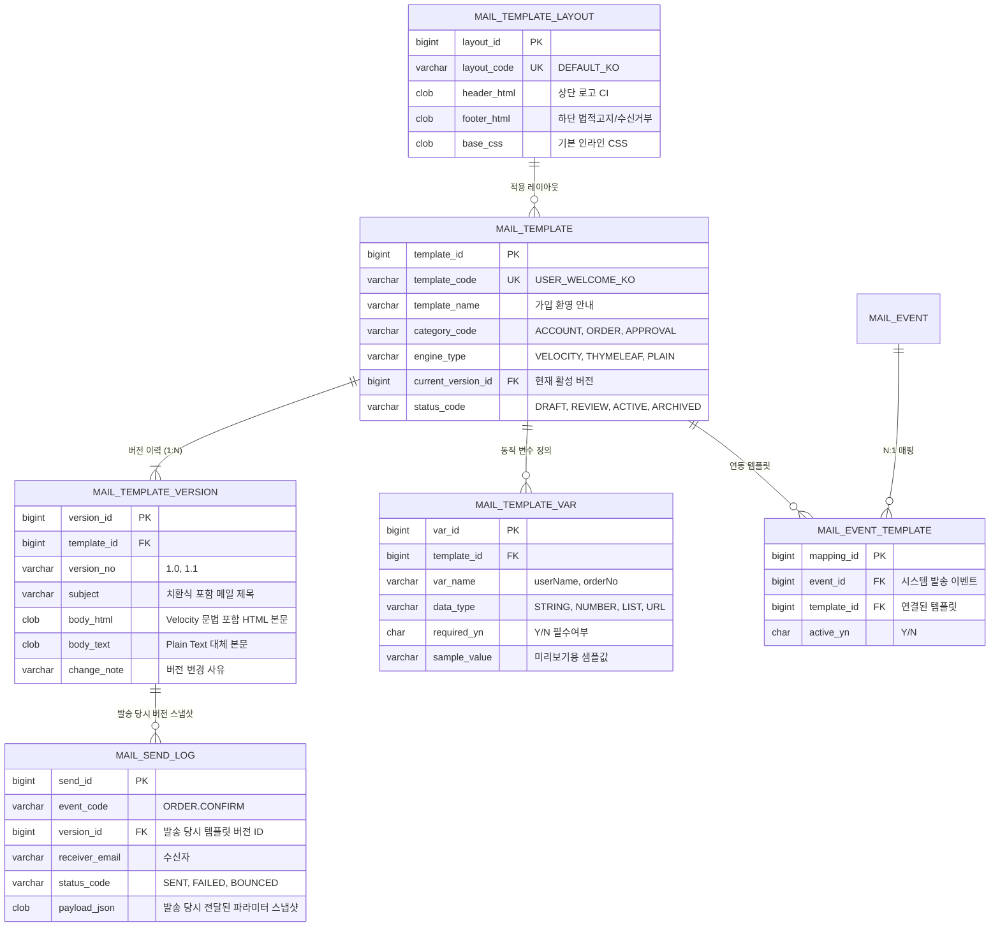

# B2B 엔터프라이즈 메일 템플릿 시스템 종합 구축 계획서 (Antigravity)

> **문서 목적**: 다른 프로젝트에서 개발자나 AI 에이전트에게 메일 템플릿 관리 시스템 구축을 지시할 때, 본 설계서의 **아키텍처, UI/UX 규격, DDL 스키마, 백엔드 렌더링 파이프라인**을 그대로 참조하여 즉시 구축할 수 있도록 정리한 표준 지침서입니다.

---

## 1. 시스템 핵심 아키텍처 및 철학

### 💡 "문법은 Velocity(`.vm`), 저장은 DB (CLOB)"
- **무중단 운영 (Zero-Deployment)**:
  - 템플릿 소스는 물리적 디스크 파일이 아닌, **DB의 `CLOB / LONGTEXT` 컬럼(`BODY_HTML`)에 저장**됩니다.
  - 메일 문구나 레이아웃 수정 시 서버 재기동/재배포 없이 **저장 즉시 0초 만에 전 서버(WAS)에 실시간 반영**됩니다.
- **다중 서버 동기화 & 버전 롤백**:
  - 클라우드/다중 인스턴스(K8s/Docker) 환경에서 파일 동기화 문제를 근본적으로 해결합니다.
  - 수정 시마다 `MAIL_TEMPLATE_VERSION` 테이블에 새 버전(Row)이 쌓여 **감사 추적(Audit Trail)** 및 **원클릭 롤백**이 가능합니다.
- **Master-Detail 고밀도 워크스페이스**:
  - **좌측(300px)**: 템플릿 목록 조회, 검색, 업무 카테고리 필터링, 신규 등록
  - **우측(가변 탭)**: 실시간 PC/모바일 미리보기, 동적 변수 Mock 바인딩, 본문 코드 편집, 시스템 발송 이벤트 매핑

---

## 2. 프로젝트 소스 파일 구성 및 참고 위치

본 프로젝트(NexHubStudio)에 구축된 핵심 소스 파일 위치 및 역할입니다:

| 구분 | 파일 경로 | 설명 |
| :--- | :--- | :--- |
| **통합 화면 (SFC)** | [`src/pages/mail/MailStudioHubPage.vue`](file:///d:/dev/workspace/NexHubStudio/src/pages/mail/MailStudioHubPage.vue) | **[핵심]** 3대 실무 탭(미리보기/소스편집/발송매핑)이 포함된 B2B 표준 2단 통합 관리 화면 |
| **라우터 설정** | [`src/router/index.js`](file:///d:/dev/workspace/NexHubStudio/src/router/index.js#L108-L115) | `/mail/studio-hub` 라우트 등록 |
| **렌더링 유틸리티** | [`src/utils/mailTemplateRender.js`](file:///d:/dev/workspace/NexHubStudio/src/utils/mailTemplateRender.js) | Velocity/Thymeleaf/Plain 문법 파서, 변수 바인딩, 레이아웃 결합, iframe 샌드박스 래퍼 |
| **목데이터 모델** | [`src/data/mailTemplateMock.js`](file:///d:/dev/workspace/NexHubStudio/src/data/mailTemplateMock.js) | 템플릿 마스터, 버전 이력, 변수 메타, 이벤트 매핑, 공통 레이아웃 시드 데이터 |
| **디자인 토큰** | [`src/assets/styles/tokens.css`](file:///d:/dev/workspace/NexHubStudio/src/assets/styles/tokens.css#L328-L368) | B2B 표준 13px 폰트 토큰(`.b2b-text-body`), 버튼, 배지, 다크/라이트 테마 규격 |

---

## 3. 화면 UI/UX 상세 구조 (MailStudioHubPage)

```
┌────────────────────────────────────────────────────────────────────────────────────────┐
│ [헤더/Breadcrumb] 홈 / 메일 관리 / 메일 템플릿 관리                                   │
├───────────────────────────────┬────────────────────────────────────────────────────────┤
│ [좌측: 템플릿 목록 & 검색 (300px)]│ [우측: 템플릿 상세 워크스페이스]                       │
│                               │ ┌─ 템플릿명 ───┬─ 템플릿 코드 ──┬─ 엔진 ──┬─ 상태 ───┐ │
│ ┌─ 검색: [ 템플릿명, 코드... ]┐│ │ [가입 환영] │ USER_WELCOME   │ Velocity│ 사용중(AC)│ │
│ ├─ 필터: [ 전체 업무 분류  ▼ ]┤ └──────────────┴────────────────┴─────────┴───────────┘ │
│ ├─ [신규 등록 버튼]           │ ┌────────────────────────────────────────────────────┐ │
│ ├─────────────────────────────┤ │ [1. 실시간 미리보기 & 변수] [2. 소스 편집] [3. 매핑] │ │
│ │ • USER_WELCOME_KO    [사용중]│ ├────────────────────────────────────────────────────┤ │
│ │   가입 환영 안내 (v2)       │ │ 툴바: [Desktop(640px)] [Mobile(375px)] [Text]      │ │
│ │ • USER_PWD_RESET_KO  [사용중]│ │       [변수값 수정] [테스트 발송]                  │ │
│ │   비밀번호 재설정 (v1)      │ │ ┌────────────────────────────────────────────────┐ │ │
│ │ • ORDER_CONFIRM_KO   [사용중]│ │ │ [메일 클라이언트 iframe 샌드박스]             │ │ │
│ │   주문 확인 안내 (v3)       │ │ │  - NexHub CI 로고 헤더                         │ │ │
│ │ • NOTICE_MAINT_KO    [작성중]│ │ │  - 홍길동 님, 가입을 환영합니다. (치환)       │ │ │
│ │   시스템 점검 공지 (v1)     │ │ │  - 발신전용 푸터 & 수신거부 링크               │ │ │
│ └─────────────────────────────┘ └─┴────────────────────────────────────────────────┴─┘ │
└───────────────────────────────┴────────────────────────────────────────────────────────┘
```

---

## 4. 백엔드 DDL 스키마 설계 및 참고 위치

타 프로젝트에서 RDBMS(Oracle, MySQL, PostgreSQL)에 테이블을 생성할 때 참조하는 SQL 파일입니다.

- **MySQL / MariaDB DDL**: [`docs/ddl/mail_template_mysql.sql`](file:///d:/dev/workspace/NexHubStudio/docs/ddl/mail_template_mysql.sql)
- **Oracle DDL**: [`docs/ddl/mail_template_oracle.sql`](file:///d:/dev/workspace/NexHubStudio/docs/ddl/mail_template_oracle.sql)
- **초기 시드 데이터 SQL**: [`docs/ddl/mail_template_seed.sql`](file:///d:/dev/workspace/NexHubStudio/docs/ddl/mail_template_seed.sql)

### 🗄️ 6대 핵심 테이블 구조



---

## 5. 백엔드 Java/Spring 렌더링 구현 가이드

백엔드에서 파일시스템 없이 DB의 CLOB 문자열을 읽어 Velocity 엔진으로 발송하는 핵심 서비스 로직입니다:

```java
@Service
@RequiredArgsConstructor
public class MailDispatchService {

    private final VelocityEngine velocityEngine;
    private final MailTemplateRepository templateRepo;
    private final JavaMailSender mailSender;

    @Transactional
    public void sendEventMail(String eventCode, Map<String, Object> model, String recipientEmail) {
        // 1. 이벤트 매핑 조회 -> 활성 템플릿 및 최신 버전 로드
        MailTemplateVersion version = templateRepo.findActiveVersionByEventCode(eventCode)
                .orElseThrow(() -> new IllegalStateException("해당 이벤트에 매핑된 활성 템플릿이 없습니다: " + eventCode));

        // 2. 필수 변수 유효성 검증
        validateRequiredVariables(version.getTemplateId(), model);

        // 3. 레이아웃과 본문 결합 (Header + Body + Footer)
        String rawTemplate = version.getLayout().getHeaderHtml() 
                           + version.getBodyHtml() 
                           + version.getLayout().getFooterHtml();

        // 4. Velocity 엔진을 이용한 메모리 내 문자열 머지 (파일 불필요)
        VelocityContext context = new VelocityContext(model);
        StringWriter writer = new StringWriter();
        velocityEngine.evaluate(context, writer, "MailDispatch_" + eventCode, rawTemplate);
        String renderedHtml = writer.toString();

        // 5. 메일 발송 및 감사 로그(VERSION_ID 스냅샷) 기록
        MimeMessage message = mailSender.createMimeMessage();
        MimeMessageHelper helper = new MimeMessageHelper(message, true, "UTF-8");
        helper.setTo(recipientEmail);
        helper.setSubject(renderSubject(version.getSubject(), context));
        helper.setText(renderedHtml, true);
        mailSender.send(message);

        saveSendAuditLog(eventCode, version.getVersionId(), recipientEmail, "SENT", model);
    }
}
```

---

## 6. 다른 프로젝트 AI 지시용 프롬프트 템플릿

다른 프로젝트나 신규 환경에서 AI(Claude, ChatGPT 등)에게 본 규격 그대로 개발을 시킬 때 사용하는 복사본 프롬프트입니다:

```markdown
[역할 정의]
너는 엔터프라이즈 B2B 시스템(ERP/어드민) 전문 시니어 풀스택 엔지니어다.

[개발 요구사항]
- 개발 대상: B2B 메일 템플릿 관리 및 실시간 미리보기/발송 매핑 화면
- 핵심 아키텍처:
  1. 템플릿 파일(.vm)을 디스크에 생성하지 않고, DB(CLOB)에 저장하여 무중단 실시간 배포 지원
  2. 좌측(300px 고정) 목록/검색 + 우측(가변 탭) 상세 워크스페이스의 Master-Detail 2단 분할 레이아웃
  3. 실시간 미리보기 시 동적 Mock 파라미터 바인딩 및 iframe 격리 샌드박스 렌더링 적용
  4. 시스템 비즈니스 이벤트 ↔ 템플릿 간 N:1 발송 매핑 통제 기능 포함

[UI/UX 디자인 필수 규칙]
1. 고밀도 B2B 규격 (Compact Density):
   - 기본 본문 13px, 메타 텍스트 11~12px (B2C용 큰 폰트 금지)
   - 모든 폼 컨트롤(`form-control-sm`, `form-select-sm`) 및 버튼(`btn-sm`) 높이 28~30px 통일
2. 중복 방지:
   - 상위 Layout과 겹치는 중복 PageHeader/h1 생성 금지
   - [신규 등록]은 좌측 헤더, [테스트 발송]은 우측 툴바에만 단일 배치
3. 디자인 일관성:
   - 프로젝트 공통 CSS 토큰(`bg-theme-card`, `border-theme`, `btn-b2b-*`, `b2b-badge-*`) 적용
```
